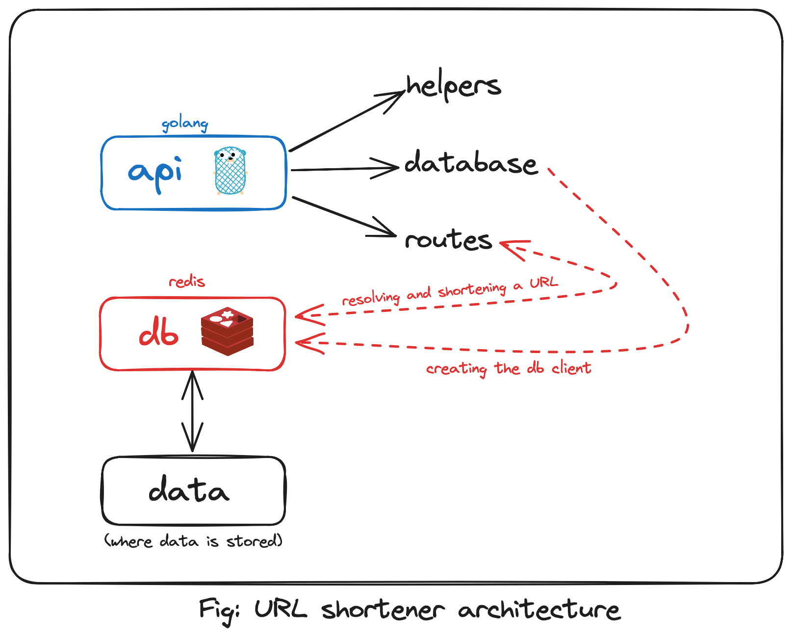
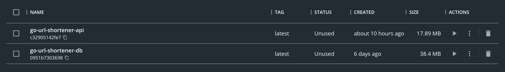

<a name="readme-top"></a>

<!-- PROJECT LOGO -->
<br />
<div align="center">
  <a href="https://github.com/ayushgml/go-fiber-url-shortener">
  
  </a>

  <h1 align="center">Go-Fiber URL Shortener</h1>

  <p align="center">
    A backend service built using Go and Redis to shorten the URL 
</div>


## About The Project
The project is a URL shortening service that provides and stores your shortened URL like bitly. This app is built using Go and Redis. For building the API I used the Go Fiber framework. This is a containerized application where we basically create 2 containers - one for API and another for Redis and then connect them using docker-compose. The API container is built using the Dockerfile and the Redis container is pulled from the Docker Hub.

## Built With

* [Go](https://golang.org/)
* [Redis](https://redis.io/)
* [Docker](https://www.docker.com/)
* [Docker Compose](https://docs.docker.com/compose/)
* [Go Fiber](https://gofiber.io/)

## Project Structure

Below is the project structure:

```
.
├── api
│   ├── Dockerfile        # Dockerfile for the API
│   ├── database          # Database package
│   │   └── database.go
│   ├── go.mod
│   ├── go.sum
│   ├── helpers           # Helper functions
│   │   └── helpers.go
│   ├── main.go           # Entrypoint for the API
│   └── routes            # Routes package
│       ├── resolve.go    # Resolve the shortened URL
│       └── shorten.go    # Shorten the URL
├── .data                 # Data directory for Redis
├── db                    # Dockerfile for Redis
│   └── Dockerfile
├── docker-compose.yml    # Docker Compose file
└── image.png
```

## Architecture and Working



The entrypoint for this applicaiton is main.go file which is located in the ```/api``` subdirectory. The ```main.go``` file first loads the environment variables from the ```.env``` file which is alsi in the ```/api``` subdirectory. The .env file looks like this:

```
DB_ADDR="db:6379"
DB_PASS=""
APP_PORT=":3000"
DOMAIN="localhost:3000"
APP_QUOTA=10
```

The ```DB_ADDR``` variable is the address of the Redis database. Since we are using docker-compose, we can use the name of the service as the address. The ```DB_PASS``` variable is the password for the Redis database. The ```APP_PORT``` variable is the port on which the API will run. The ```DOMAIN``` variable is the domain name of the API. The ```APP_QUOTA``` variable is the number of shorten URL requests that can be made to the API in 30 minutes.

After loading the environment variables, the main function then creates a new fiber app and then registers the routes. The routes are defined in the ```/api/routes``` subdirectory. The ```/api/routes/shorten.go``` file contains the logic for shortening the URL. The ```/api/routes/resolve.go``` file contains the logic for resolving the shortened URL. The ```/api/database/database.go``` file contains the logic for connecting to the Redis database. The ```/api/helpers/helpers.go``` file contains the helper functions.

The routes and the database package interact with the Redis database using the [go-redis](https://github.com/redis/go-redis) package. 


## Installation and Running the Project

1. Clone the repo and change the directory to the project directory
   ```sh
   git clone https://github.com/ayushgml/go-fiber-url-shortener.git
   cd go-fiber-url-shortener
    ```

2. Create a .env file in the ```/api``` subdirectory and add the variables.
   ```sh
   cd api
   touch .env
   cd ..
   ```

   Also the .env file looks like this:
    ```
    DB_ADDR="db:6379"
    DB_PASS=""
    APP_PORT=":3000"
    DOMAIN="localhost:3000"
    APP_QUOTA=10
    ```

3. Run the following command to start the application
   ```sh
   docker-compose up
   ```

   As this is a microservices architecture based that contains of 2 services - API and Redis, we use docker-compose to run the application. After the containers are up and running the API will be available at ```localhost:3000```. The containers look like this in your Docker desktop:

   


## Contact

Ayush Gupta - [@itsayush\_\_](https://twitter.com/itsayush__) - ayushgml@gmail.com

[Project link](https://github.com/ayushgml/go-fiber-url-shortener)

